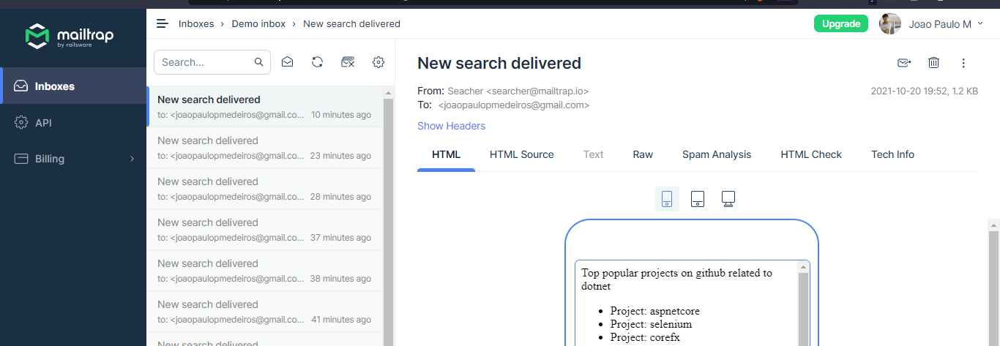

<h1 align="center">Github Trend Topics Searcher</h1>

## Description

What about you write a text file on your desktop with a term such as 'dotnet' or 'node' and a list of e-mails for getting magically notified?? <br/>
This simple windows service might lead you to a better understanding of workers, background jobs and get up to date with open source world in a fun way!

## Features

- Read keywords and list of e-mail recipients from text file;
- Search content based on a given term using github;
- Send e-mail with final result;

## The search.txt file

```
<your_search_term>; <email1>,<email2>,<email3>;
```

## Result

You can check this out using a <a href="https://mailtrap.io/">mailtrap</a> account or any e-mail provider.


<hr>
<div align="center">Made with ❤️ by joaopaulopmedeiros</div>
